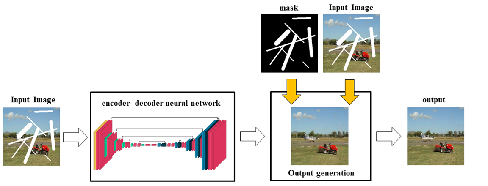
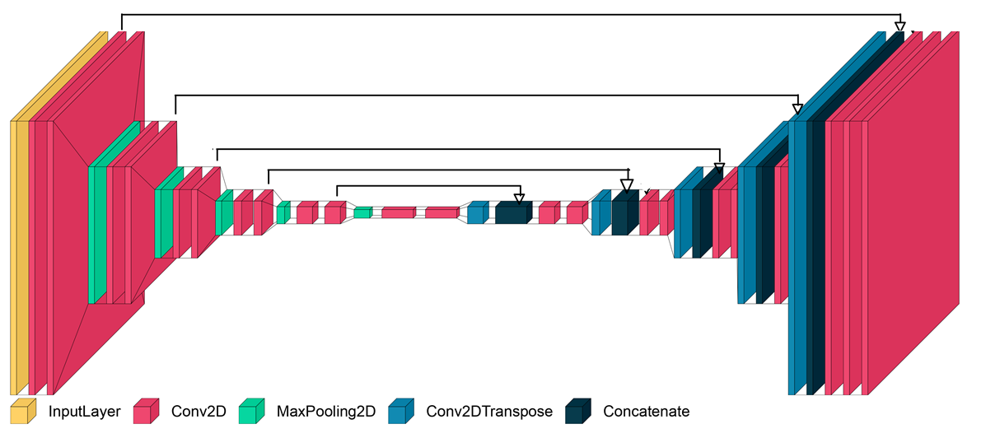

# Image Inpainting Using AutoEncoder and Guided Selection of Predicted Pixels

 

    
Abstract (click to view)

Image inpainting is one of the most important ways to enhance corrupted digital images or pictures with missing pixels. For this purpose, different methods have been proposed. Some methods use the information of neighboring pixels to reconstruct the image. However, recent advances in deep learning have shown that receiving reasonable structural and semantic details from images can solve this problem. In this paper, we propose a network for image inpainting. This network, similar to U-Net, extracts various features from images, leading to better results. We improve the final results by replacing the damaged pixels with the recovered pixels of the output images. Our experimental results show that this method produces high-quality results compare to the traditional methods.

 

    

Block diagram of the proposed method.

---

    

Encoder-decoder structure of the proposed method.

## Dataset
- The created dataset is available at: [google drive](https://drive.google.com/drive/folders/13svFUo7ra9ip7Pm0fENZ1OZIkJo8cTER?usp=sharing).
